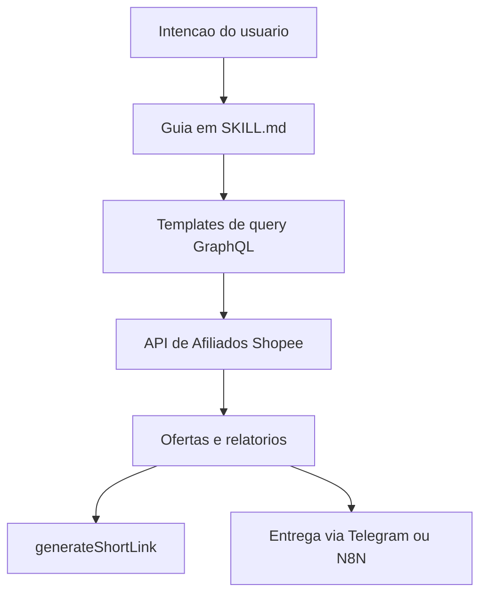

# Arquitetura

## Componentes em alto nivel

- Definicao da skill: `SKILL.md` e o ponto de entrada e guia rapido.
- Biblioteca de referencias: `references/` contem docs detalhadas e exemplos.
- Servicos externos: Shopee Affiliate GraphQL API, Telegram Bot API, N8N.

## Fluxo de dados (conceitual)

## Fluxos principais

- Descoberta de ofertas: query `shopeeOfferV2` ou `productOfferV2`.
- Rastreamento: `generateShortLink` com subIds.
- Relatorios: `conversionReport` e `validatedReport` com scrollId.

## Pontos de extensao

- Adicione novos docs em `references/` para endpoints ou workflows.
- Mantenha `SKILL.md` conciso e aponte para as referencias.
